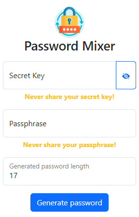

# PassMX API - Password Mixer API

[PassMX](https://github.com/tory1103/passmx.git) is a password generator that mixes a secret and a passphrase to generate it. It's NOT a password manager or password store, it's just a password generator.

This is the API for PassMX, it's a simple REST API that receives a secret and a passphrase and returns the generated password.

